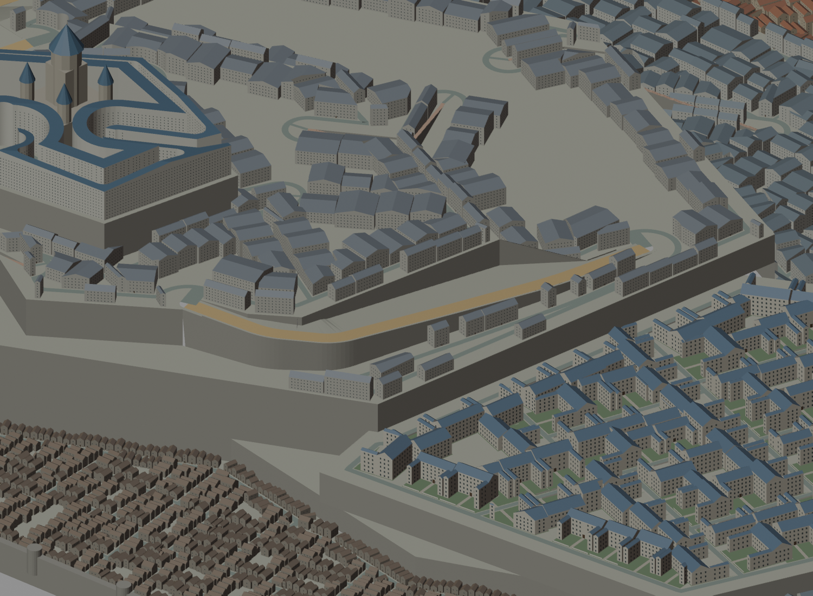
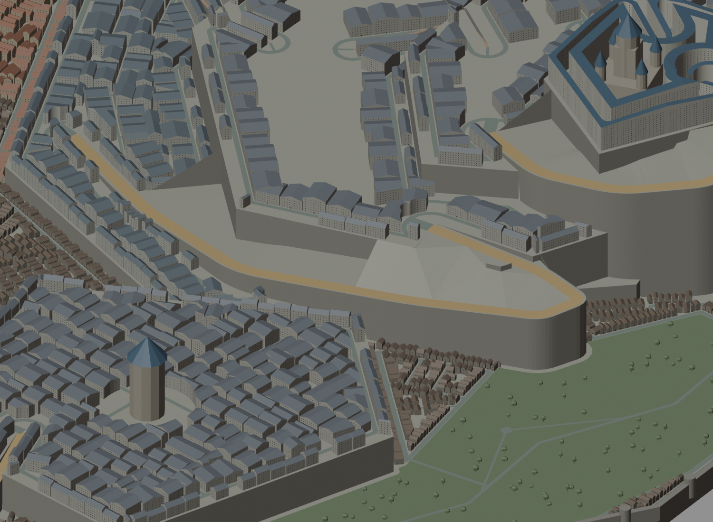
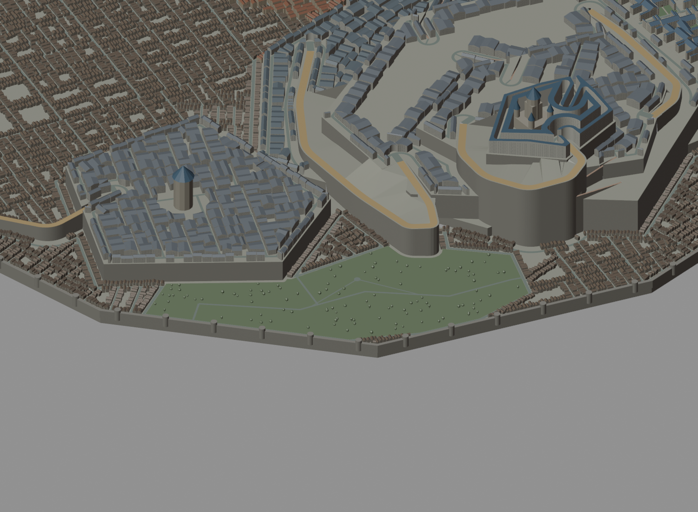
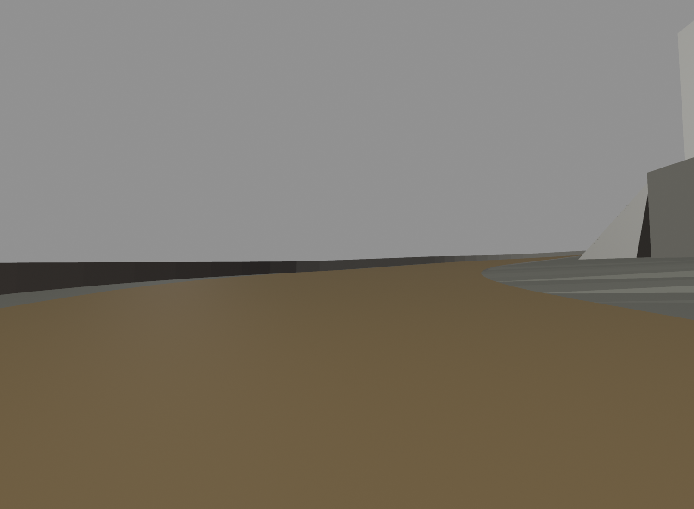
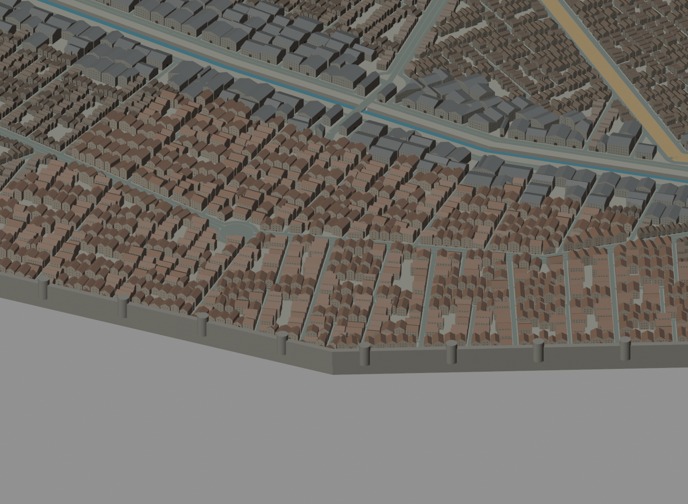

# B39 — 街区内部・段丘沿いの坂・北側緑地の統合レビュー
2026-10-07。**未完成・未公開。都市全体の受入合格ではない。**

## 原因と変更
ユーザーの2枚のスクリーンショットはいずれもPCのB23を表示していた。旧版やユーザーの未保存シーンを上書きせず、B39を別ファイルとして保存した。

街区面積だけで分割を止め、街路沿いに一列の敷地を置く方式が大きな残余地を生んでいた。残余地の面積と内部半径を測り、住宅系の14/42/70m段丘で深すぎる街区に4mの生活路を追加して再敷地化した。市場・共同井戸・正本施設敷地などを保護し、貴族の私有庭や王城前庭を一律に埋める処理にはしていない。
B27の大きな未割当空間301か所から、統合B38/B39では37か所。大きな未割当面積は1,150,134m²から101,863m²。ただし減少には北側を用途のある緑地として予約した面積を含む。「全て建物で解消した」という数字ではない。37か所は未解決のまま明示。

court_west_ramp、civic_royal_ramp、castle_east_rampは幅18mの道路と両側の地盤を持つ案へ変更。西側は段丘壁へ寄せ、行政側と王城東側は折り返す接近路へ変更した。道と受入段丘の間を勾配のある地盤で接続し、外縁の落差がある箇所に1.3mの防護壁を生成する。元の細い支持壁から、地盤と道路を一緒に確保する方式へ変更。
B32で王城東側の支持壁と北階段が干渉したため、階段部分に4.5m以上を目安とした開口を確保。これはゲーム内寸法の案で、実際の建築安全基準への適合を意味しない。
B31の生成処理は交差点検索が過大になり、当作業で起動したPythonプロセスのみ停止した。空間索引へ変更して再実行。ユーザーのBlenderプロセスは停止していない。

北側空白は、密集地区との対比を作る城壁下の緑地・保守路案へ変更。既存の世界へ新しい施設IDや文化設定を追加していない。直接進む5mの道と、休息場所を経由する3.2mの回遊路が同じ道路グラフにつながる。回遊路約321m、休息場所半径8m、樹木112本。木は道・敷地の検査から除外していない。

孤児院に約62mの2.8m幅の裏道を追加。建物脇を回り、別の生活路へ接続する。T10の大型店は引き続き同じ敷地。NPCワープや貴族街の進入制限回避は追加していない。

## 確認結果
- 通常1,073経路、増水1,072経路、いずれも連結成分1。
- B35→B37回帰検査：既存661経路を保持、新規410経路、正本2施設の敷地・建物・入口・T10同一敷地を保持。
- 全体の道路幅方向の胴体高レイ253,440本、遮断0。樹木を含む。連続カプセルや荷車試験ではない。
- 床面18,337サンプル、異常0。道路中央のサンプルであり、全歩行可能面の保証ではない。
- 7階段の段差・踏面・踊り場検査を維持。
- 3D最終建築敷地レコード17,994。正本の人口・建物数の確定ではない。
- 車道の最大平均勾配7.83%。全交差点での実車旋回試験は未実施。
- Blender俯瞰・坂の目線・緑地の目線・東側街区の固定視点比較を実際に目視。
- 既存Web実装は変更していない。本番URLでB39が見えるという意味ではない。

## 目視で残った課題
1. 坂は地盤とつながったが、途中の目線ではまだ単調な区間がある。平らな退避場所、横への眺望、階段との分岐を追加して再評価する。
2. 今回再設計した坂は3本。残りの坂・階段全てを同じ品質で確認したとは言えない。
3. 上層・前庭の大きな空間、残る37か所の未割当地を個別に設計する。
4. 緑地は道の選択と密度差ができた段階。生活行為、休息の具体物、時間帯の人流は未実装。
5. 住宅列の反復は改善途中。市場・下層・亜人街・貴族街を実際の歩行シーケンスで比較し、素材だけでなく路地の曲がりや広場間隔を調整する。
6. 土地課、他の正本施設、社会ゲート、NPC schedule、事件状態、本番GLB統合、ゲーム内全経路完歩は未完了。
7. 王城や塔の視線監査を新街区全域でやり直す必要がある。

## 再現・引継ぎ
PC: さつまあげ。
出力: C:\Users\inaba\Documents\TRPG-Capital-Blender\design-b39\capital-parcel-review.blend
地形のみ: 同ディレクトリ capital-city-b01.blend。
ソース: C:\Users\inaba\capital-pass-8-review\tools\trpg-world\blender。
旧B23とB02の未保存シーンを保持。

生成順（新しいディレクトリを使い、既存ファイルは上書きしない）:
1. plan-city-b.py → parcel-city.py（B34）
2. author-capital-sites.py（B35）
3. repair-block-interiors.py → parcel-city.py（B36、続けてB37）
4. audit-block-repair.py B35 B37
5. author-orphanage-backlane.py（B38）
6. author-garden-loop.py（B39）
7. audit-city-b.py、--flood版、build-city-b.py、build-parcel-review.py
8. audit-blender-width.py、audit-blender-floor.py、render-ascent-review.py、render-interior-comparison.py、render-canonical-sites.py、render-landscape-walk.py。

Pythonの形状処理にはBlender付属Pythonと既存python-depsを使用。Blender起動前はPYTHONPATHを解除。
GitHubが正本の保存先。ローカルgit HEADは古いままでAPIコミットを利用している。無関係なdirty QA画像/JSONを取り込まない。main/VPSの更新はしていない。

## 証拠画像

