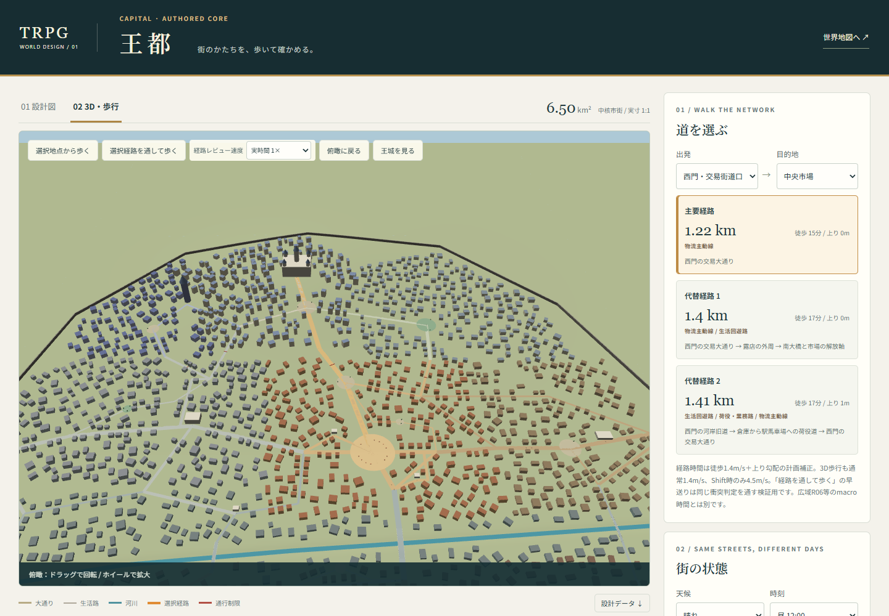
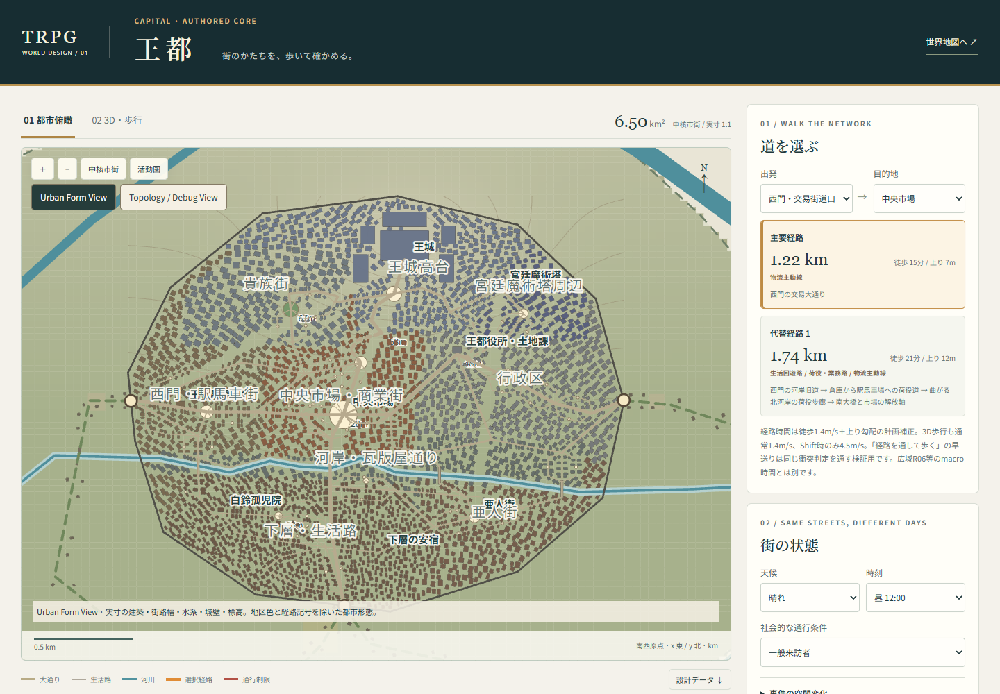
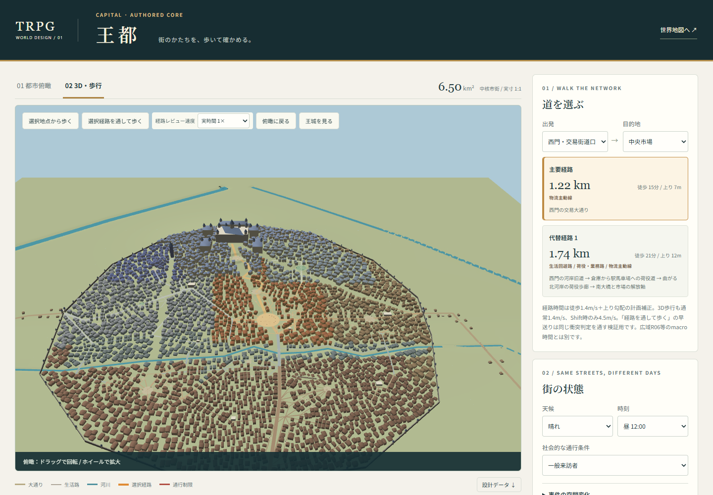
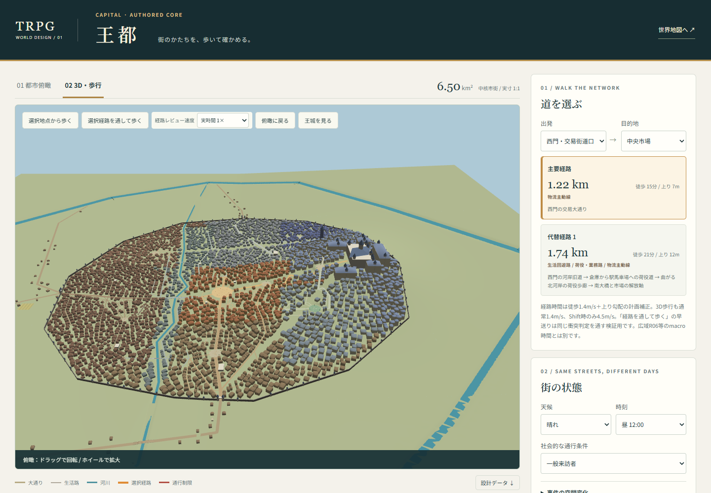
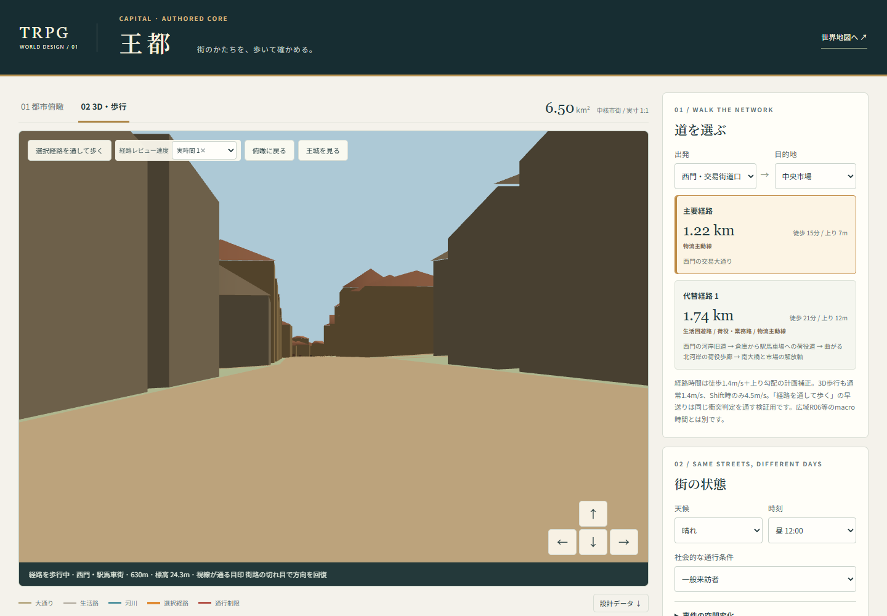
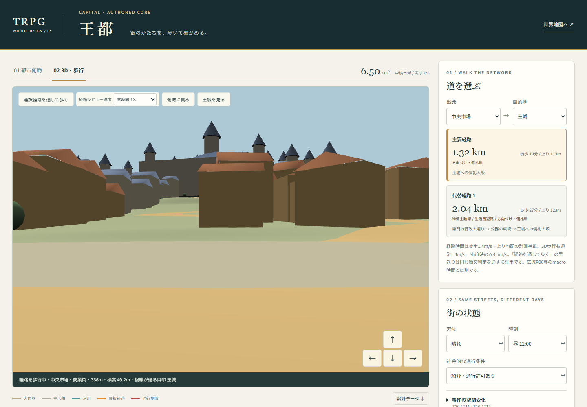
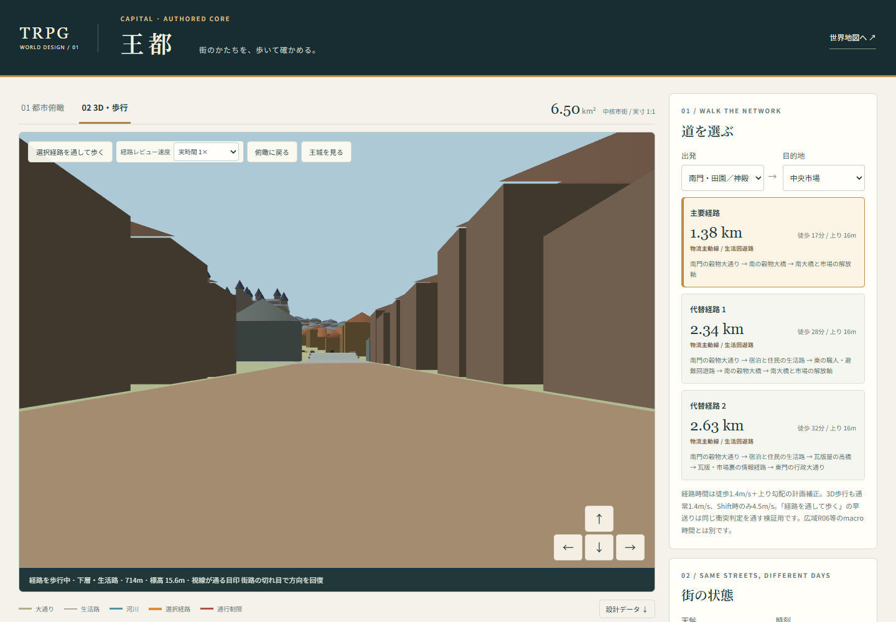
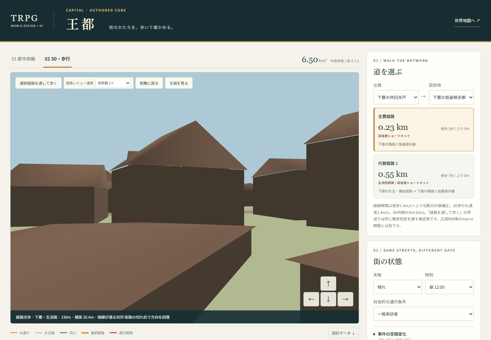

# 王都 Urban Morphology Pass 4

## 判断根拠と比較

王都参考画像2枚を都市のmacro/meso形態資料として、添付「TRPG世界の地域設計・レベルデザイン・実装優先度に関する調査報告(4).pdf」（23頁）を主要な設計根拠として使用した。PDFの施設候補座標は設計提案であり、正本IDと事件設定を優先する。川幅は依頼で確定した局所水路16m、増水22mを継承する。既存atlasの本流・西水道は改変しない。

実装前に公開main `85416dfe8717b28e0c4f0fc38d4543cfe4d5d7ff` の2DとBabylon/WebGL実画面を確認した。14経路の連続歩行を行い、次の不足を整理した。

1. 王城の巨大な量感と城丘の厚み。
2. 低地、市場、上層、王城の立体的階層。
3. 等高方向の街路と段丘。
4. 連続する街路前面の建築。
5. 不規則な街区と内部中庭。
6. 地区ごとの屋根群・街区粒度。
7. 王城へ近づくにつれて変わる建築格。
8. 曲線街路と小回遊路。
9. 河川の曲がりに応じた河岸・橋詰。
10. 城壁、壁塔、門の立体的な通過体験。
11. 郊外から城内へ移る密度差。
12. 密集街区に囲まれた広場の開放感。
13. 低屋根道を支える連続した建築。
14. 王城、塔、門、屋根によるスカイライン。
15. 実形状を評価する俯瞰表示。

維持した資産は12施設ID、T10の孤児院用地再利用、T10/T11/T16/T17、社会通行条件、道路の役割、NPCとプレイヤーの共有道路、R06/R11/R12/R13への正確な接続点、6.5km² coreと非相似の約22km²活動圏。地盤、建築生成、城の量感、街路・水系曲率、都市形態表示を再構成した。本編のセーブ、正本、atlas原データは変更していない。

## 空間の変更

- 城丘を高くし、市場にも中段地盤を設けた。王城前庭・貴族庭園・坂下・役所は水平部と周囲への連続した接続を持つ段丘として整えた。
- 王城主殿310×190mに、5つの翼棟・北館、複数の塔と屋根を組み合わせた。全て `LOC_CAP_CASTLE` の構成建築であり、新施設を追加していない。
- 役所の入口を旧候補 `[23.08,21.58]` から城丘の裾 `[23.00,21.88]` へ移した。施設ID・用途・事件対応を継承し、公務路を再接続した。
- 街路前面を先に囲い、背後を城丘の等高方向に沿う不規則な街区として配置する生成へ変更した。下層の小さな建築と貴族街の大きな建築を区別し、屋根を実形状にした。斜面の基礎を地形へ埋めた。道路の左右端も物理面と同じ高低差で描画し、中央だけの高さで浮く旧ribbonを修正した。
- 街区内部の小庭、荷車を避ける生活回遊、城壁沿いの路地、河岸の荷役歩廊、通り抜けない袋小路を加えた。小庭は建築除外に加えて舗装面と生活の余地を持つ。
- 局所水路に曲がりを設け、既存の本流・西水道を活動圏まで描画・地形・衝突へ接続した。街道の実際の横断に構造的な高橋を設けた。既存水系の正本形状は維持し、レビュー範囲外の全流路を空中に描かない。
- 門の両側の塔と門上の構造、外周の壁塔を追加した。疎な郊外建築は同じ街道に沿って密度を下げて配置する。
- 低屋根の上下を12mの階段区間へまとめた。段の形状と同じ傾斜を歩行面が連続して支え、屋根の下にも建築がある。周囲は実際に低い屋根群として、到達時のprospectを確保した。
- 重複していた物理街路を統合した。主要な代替経路はedge集合に加えて実距離の重なりを評価する。小回遊を多数のedgeへ分割して主要な別経路に見せることを防ぐ。

## 形態の受入基準

|尺度|実画面で確認すること|検証箇所|
|---|---|---|
|Macro|城丘の王城群を頂点とする、壁内の密集都市と疎な門外の対比|南・東・西の俯瞰|
|Meso|標高、街区粒度、道路幅、屋根高さで地区を読める|市場→王城、下層、行政の接近|
|Micro|大通りに加え、路地・中庭・袋小路・河岸・階段・屋根の選択がある|街区回遊、低屋根、城壁沿い・河岸の歩行|
|Visual hierarchy|王城群、魔術塔、門・橋・市場、地区の建築の順で方向回復できる|予約視点と各経路の可視/遮蔽サンプル|
|Skyline|平らな屋根の箱だけでなく、屋根・翼棟・高塔・壁塔が異なる輪郭を作る|俯瞰と王城接近|

2Dの既定は **Urban Form View**。実建築footprint、街路幅、水幅、橋、城壁、段丘の等高線と標高、空地、郊外を示す。**Topology / Debug View** は接続、地区、経路、通行制限、設計beat、NPC交通を監査する。都市形態の評価を地区polygonの色に置き換えない。

## QAと再実行

既存36テストを維持し、P2と形態の回帰検証を加えた44テストを実行する。

```sh
node --test test/capital-review.test.mjs test/capital-clock.test.mjs test/capital-morphology.test.mjs test/world-blueprint.test.mjs test/world-blueprint-ecology.test.mjs
node tools/trpg-world/audit-capital-browser.mjs --url=http://127.0.0.1:9894 --out=/tmp/capital-pass4 --playwright=/path/to/playwright/index.mjs --browser=/path/to/chrome
node tools/trpg-world/verify-capital-public.mjs --url=https://siranui.jp --report=/path/to/browser-audit.json
```

ブラウザ監査はBabylonの実レンダラーと同じ足場・swept collisionを使う、目線高さの連続歩行である。診断用にシミュレーション時間を進める。主要14経路を25/50/75%と終点で撮影し、増水と各事件の迂回、朝昼夕方、モバイルも確認する。実時間1×の通常歩行1.4m/sと診断の早送りを混同しない。

PR #332/#333のP2は、経路消失時のguide停止、10FPSでも経過時間を切り捨てないphysics更新、保存済みproduction監査JSONの相対参照を修正した。ブラウザでも経路を消して移動が止まること、10FPSの1秒で1.4m移動することを確認する。

比較画像と監査JSONは `qa/capital-pass-4/` に保存する。プロキシNPCは生活導線のレビュー用で、本編AI・save・事件自動進行・最終アートは今後の統合工程である。

## 比較画面

### Pass 3：都市形態の再構成前



### Pass 4：都市の実形状





### 目線高さの連続歩行





