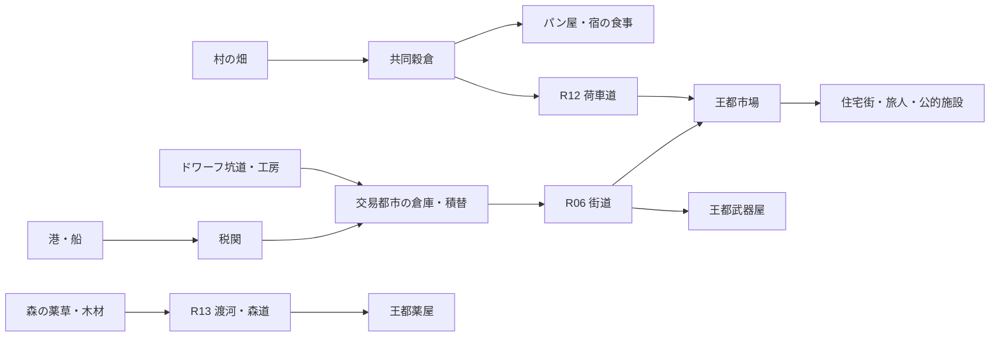

# TRPG（仮） Spatial Foundation

更新: 2026-09-26。段階: **機能配置の基盤を実装中。Spatial Foundation完了ではない。**

## 設計対象

外観を整える工程ではない。名前付きの箱でよい。しかし、その箱が何のためにそこにあり、誰がいつどこから来て、何を持ち、誰と接触し、どこで見えなくなるかには理由が必要である。

工程は Causal Foundation → Spatial Foundation → 5本の攻略筋の手書き設計 → Day1–10実走 → World Art & Spatial Rebuild。現在の座標を攻略の永久条件にしない。

正本は [TRPG 総合設計書](https://docs.google.com/spreadsheets/d/15slftR2b-76VKaUqTisYolhN1iCpHeB7asUBoyMnmRk/edit)。本フェーズで2/4/5/6/7/10/11/12/14/18/21章、拠点・距離・各地域・NPC・仕事・トラブル・天候・世界史・商品、戦闘マスターの地域別エンカウント/行動、スキル取得分類を参照した。21章の現行工程順を旧Day10先行方針より優先する。人口の設計レンジと下記の地区編成は今回のauthoringであり、Sheet原文の数値と称さない。

## 三層を混同しない

1. **World Design**: 食料・水・資源・産業・権力・居住・交易圏。都市が存続できる理由と依存先。
2. **Level Design**: 入口、通過、滞在、近道、遠回り、死角、段階的な見え方。歩く選択の意味。
3. **Systemic Spatial Design**: 同じ空間を実際のNPC、運搬、危険、会話、警備が使う。接触は位置・時刻・知覚から判定する。

「道を曲げた」だけでは完成ではない。「商人の道と住民の道が市場で重なり、荷捌き裏では広場から見えない」が検証単位になる。直線自体は禁止しない。軍道や計画的大通りには理由がある。全入口から全目的地が一直線に見える構成を避ける。

## authoringから実装への契約

`settlement-design.mjs` に役割、人口規模の設計目安、地区、施設ID、交通目的、時間帯、接点、危険の理由を置く。`region-layout.mjs` は差し替え可能な座標・壁・街路を持つ。施設IDは行動/保存/履歴と共有し、地区名やmesh名で置換しない。

村・王都・交易都市の動線は、実施設とR番号の出入口を参照する。生成時に全区間を実際の街路ナビゲーションで探索し、衝突と未接続を検査する。地区ごとの既存住民/職場の割当も出力する。設計動線は自動輸送ではない。未割当の荷や住民を生成したことにはしない。

人口レンジ（村180–320、王都6,000–12,000、交易都市2,500–5,000）は都市形態を考える仮のスケールであり、現在の111 actorとは区別する。数千人が既に存在・生活していると表示しない。将来追加する住民も同じ存在論を使う。

## 住まいから生活圏を作る

`residence-authoring.mjs` が全111 actorの居住・滞在・生息/格納先を明示する。NPCの行番号で宿や建物を巡回割当する処理を廃止した。74の居住/拠点レコード、安定したresidenceId/homeFacilityId/roomIdと実際に歩けるhome座標を持つ。既存105施設を維持し、村6棟・王都6棟・交易都市5棟、計17棟の住宅grayboxを追加。

- **世帯**: フィンとミラ、リュシアと親のナーウェなど、根拠のある同居を明示。親子か不明な人物を年齢や職業だけで家族にしない。未登場の家族NPCは生成しない。
- **職住一体**: パン屋、薬屋、武器屋、宿の主人は営業場所と住居区を共有するが部屋IDを持つ。
- **共同生活**: 孤児院、兵舎、住込み職員区画、借室を区別。王が孤児院で寝る、孤児が全員安宿で寝るような割当を除去。
- **定住と滞在**: 行商・使者・巡礼のtemporary-lodgingと、同じ宿に長期で住むrented-roomは別。宿主人と客を同一世帯にしない。
- **非住民actor**: キングスライムは河川habitat、巨神兵はdepot。人間の家に住むとは扱わない。ただし非人間actorの日常plannerそのものの再編は別の残件。
- **空間**: 各homeから入口、道路、職場への移動を検査する。NPCは日中に出勤し夜は実座標へ歩いて帰る。退去・救助等の既存displacedHomeは通常住居より優先し、強制帰宅させない。
- **保存**: 住居の意味上のIDはcanonical contentに保存し、saveのcontent revision/hashと対応する。ロード時に全NPCを新しい家へ飛ばさない。現在位置・過去の記憶を保持し、通常の次の帰宅行動で帰る。

現段階の部屋はground-floorの位置割当。間仕切り、寝具、私室の鍵/アクセス権、家賃契約、家の中での食事・収納、遠方からの帰郷/一時宿の選択はまだ未完成。特に長屋・店舗併設住居の生活面積と入口分離は次のgraybox改修対象。`household` は登記上の所有権を自動付与する値ではない。

## 食料圏・金属圏・情報圏

これは物流の設計。既存shipmentは実在carrier/custody/route/timeで動くが、この図の全矢印に生産・消費・補充のactorが揃ったわけではない。武器屋であらゆる食料が買える現行の広い品揃え、食堂の注文、製造量と在庫の連結は次の機能配置作業に含める。

## 村・王都・交易都市の編成

### 田園の村

- 生業: 麦、家畜、王都への出荷、旅人の宿泊。
- 西: 耕地と共同穀倉。収穫路は畑の縁を回り、井戸の生活動線を貫かない。
- 中心: 広場、井戸、村長宅。水汲み・相談・荷改めが重なる。
- 南～東: 麦穂亭、パン屋、馬小屋、修理屋。宿は住民の食事と旅人の情報交換にも使う。馬屋と荷車は客室前の狭い通路から分ける。
- 北: 柵、牧草地、林への見張り道。獣道と作業道の接触が危険を生む。
- 道路: 村道 → 荷車の農道 → 畑縁の徒歩道。field-edge/pasture-laneで回遊できる。
- 次の空間作業: 用水路/小橋、民家と納屋、畑の通行権、穀倉への実入荷。現在の畑矩形は最終地割ではない。

### 王都

- 生業: 行政、軍・宗教/魔術、広域消費と加工。食料自給を仮定しない。
- 北: 王城・役所・魔術塔。来訪者が全員王城前を通らなくてよい。
- 中央: 市場・武器屋・薬屋。R12の穀物、R06の交易品、R13の薬草が接続する。
- 南: 駅馬車場と瓦版。到着客はここから安宿と市場へ分岐する。
- 西南: 安宿・孤児院・生活路地。立退き後の大型店は同じ土地の用途変更であり、初期から独立した繁盛店と数えない。
- 東: 河岸に関係する住居・労働地区。住民の出自を治安値にしない。治安差は見通し、通行量、警備の配置、制度と実際の行動から生まれる。
- 武具: 製造元は坑夫都市の工房、王都側は販売・補修。鍛冶の全製造工程は未接続。
- 日常: 住宅→市場/職場、駅馬車→宿、役所→現地という異なる行先を確保。
- 警備設計: 城・市場・到着口を巡る幹線と、荷捌き裏の監視差。現行の全guardがこの巡回を実行しているわけではない。
- approach: 南の到着帯→荷捌き庭の背壁→左右の通路→市場の通り→行政街。背壁はcollision/LOSと描画で同じ寸法。角を回ると視界が開くことを契約テストにする。
- 次の空間作業: 大門、周壁、身分/職種に応じた住宅、市場の実荷受け、衛兵の巡回、R06/R13からの別approach。

### 交易都市

- 生業: 海と陸の積替、魚、船の修繕、契約・信用。
- 西: 港→税関→保管。通関済みの荷を内陸へ流す。港から王都へ直接在庫値を移さない。
- 西南: 魚市場と船大工。魚の鮮度と重い船材を水辺に近づける。
- 中央/北東: 商人ギルド、領主館。監督する立場でも倉庫内部は見えない。
- 南東: 宿・薬草商・荷馬車組合。船員、御者、商人、旅客が交わる生活帯。
- 道路: 岸壁の荷車道、倉庫裏の作業路、宿と魚市場の歩行回遊を区別。
- 次の空間作業: 船の実乗降、停泊・積卸しspace、宿の食事、住宅、岸壁への段階的reveal。現行のboat commandのみでは交通完成と呼ばない。

## 残る8地域の設計枠（まだ機能地区のcompiler binding未実装）

|地域|成り立ち・地形|街区・入口・見え方|生活/交通/危険の接点|
|---|---|---|---|
|犯罪都市|岩島の裏港、密輸と普通の生活|東埠頭→倉庫→市場→路地。倉庫角の遮蔽、裏宿への別経路|船荷、偽造契約、宿、荷役。全住民を犯罪者扱いしない|
|辺境の村|乾いた農地と巡礼経済|井戸→宿→参道口。畑の外縁から神殿の稜線を見せる|水、食事、巡礼馬屋、案内人。旅客集中が給水へ影響|
|古代神殿|台地の遺構と管理共同体|正門→受付/休憩庭→回廊→封印区。奥を入口から全て見せない|巡礼客・管理人・補修資材。危険区は生活導線と区別|
|森|河川、林縁、樹冠、獣の領域|入口→馬留め→野営地→渡河→奥の分岐。林で視界を区切る|採取者・狩人・川・巣・餌場。川/巣は宿泊施設ではない|
|エルフの里|世界樹と結界、共同生産|根道→客間/評議→住居→薬草園。住居と軍事の入口を分離|内部交換、薬草、客の承認、避難枝道|
|北陵要塞|峠の軍事・補給拠点|南の補給口→倉庫/厩舎→兵舎→司令→北門。岩壁で区切る|兵站、交代巡回、診療、検問。北門は単なる移動ボタンでない|
|ドワーフ洞窟|採掘と金属加工|門/荷駄→市場→工房→採掘。坑道の曲がりと工房庭|鉱石・食料輸入・武具輸出・排水・救助。坑内交通と客の宿を分離|
|黒嶺|水路を共有する多種族共同体|外門→共同市場→評議/居住/軍営へ分岐。水路に橋|水、難民、交易、軍。軍営が唯一の中心にならない|

## R01–R15：地形と移動の理由

Sheet値は晴天時baseline。R08はSheet自体が船なので、徒歩3時間と解釈しない。現在runtimeの10日用圧縮値は別フィールド。以下の馬車/飛行等は適性の設計であり、運行車両の完成表ではない。

|路線|区間 / baseline|地形・道路・途中の目印/休止|人/荷/危険|交通差・代替|
|---|---|---|---|---|
|R01|要塞–洞窟 / 徒歩2h|雪解け鞍部・軍道、石切場/風除け|鉱夫・補給兵、鉱石/武具、岩場の獣|荷駄馬、車両は難、飛行は横風|
|R02|要塞–黒嶺 / 徒歩6h|旧戦場・荒れた峠、関門/監視所|部隊・使節、食料/軍需、検問|旧石道に馬、飛行も監視域|
|R03|要塞–交易 / 徒歩6h|丘陵河谷・補給道、橋/中継宿|商隊・補給兵、食料/薬/木材|荷車適、峠の天候|
|R04|洞窟–交易 / 徒歩4h|鉱山斜面・折返し道、水場|坑夫・職人、鉱石/工具|荷駄向き、大車は難|
|R05|洞窟–黒嶺 / 徒歩6h|地下坑道、縦坑/避難所|案内人、金属/密輸品、地下生物|馬車・箒不可|
|R06|交易–王都 / 徒歩2h|海岸段丘→河岸、石橋/街道宿|商隊・使者、魚/塩/輸入品|馬車適、飛行は城外着陸|
|R07|交易–神殿 / 徒歩5h|枯谷・台地、石柱/井戸|隊商・巡礼、水/布/資材|給水を要する馬車道、砂塵|
|R08|交易–犯罪都市 / 船3h|岩礁航路、灯台/泊地|船員・旅客、積荷、荒天/封鎖|船の実運行が必要、馬も船積み、海上着陸不可|
|R09|辺境–神殿 / 徒歩0.5h|畑→参道、小祠/休み石|巡礼・供物/水|馬繋ぎまで、聖域着陸制約|
|R10|神殿–田園 / 徒歩3h|荒野→麦畑、見張り丘/用水路|巡礼・農民、穀物/縄/木材|農道の荷車、飛行は地上接触を失う|
|R11|神殿–王都 / 徒歩4h|旧巡礼街道、里程標/宿場|役人・研究者・文書/資材|馬車適、城内飛行制約|
|R12|田園–王都 / 徒歩1h|畑・小橋・並木→門前、荷改め|通勤・出荷、穀物/飼葉|主要荷車道と堤沿い徒歩道、飛行は城外へ|
|R13|王都–森 / 徒歩6h|河岸林・炭焼き跡→渡し/休場|狩人・斥候、薬草/木材、群れ|馬留め、狩人の別道、樹冠と霧|
|R14|森–里 / 徒歩0.17h|根道・結界石→庇|承認客・生活物資|案内/承認。飛行で結界を迂回不可|
|R15|森–黒嶺 / 徒歩5h|源流河谷→峠、野営地|案内人・避難民、薬/資材、大型獣|道の発見と案内、峰の風|

`route.spatial` に地形、理由、途中landmark、適性、共有progressを保存。現在は出入口とmacro journeyが主で、途中の街道sectionを実際に歩く/途中下車/旅中接触は未完成。15本の航路/街道を「空間として完成」とは報告しない。

## 現在runtimeに接続したもの

- 5地域の街路loopと郊外approach。NPCの通常移動は描画と同じ街路graphを利用する。追跡・緊急行動は衝突回避を優先。
- 平面交差/T字路をgraphへ接続。点がたまたま同じ配列座標だった場合だけ接続される問題を除去。
- player/NPC/actor journeyの到着は同一路線の反対側の入口。街の中央spawnへの到着を除去。
- 村・森の恒常monsterに巣/水/餌場/活動時間/天候を接続。ただし全生態・群れ移住・macro中の生態時間は未完。
- 施設判定を単語境界に修正。FOREST中のRESTで川や巣を宿扱いしていた誤りを除去。
- 汎用事件観察を済ませたNPCが終日同じ現場へ集まり続ける問題を抑制し、生活/仕事へ戻れるようにした。専門の救助・警護・執行assignmentは継続する。
- 替えたgeometryが現在のbody/pathと衝突する旧saveは、hash承認済み移行で近傍の安全位置へ補正し無効pathのみ再探索。履歴の過去座標・知識・所有権は変更しない。

## 検証と次の完成条件

見た目が曲がっているだけで合格にしない。各設計flowは本当に通れるか、誰が使ったか、どこで会ったかを確認する。機能施設のreachability、交差点、arrival continuity、LOS、save、replay、既存causal regressionを検査する。browser観察結果と正確なtest結果は同日continuation reportへ記録する。

次は住居の室内区分・店舗との入口分離、売る品/作る物/食べる場所の分離、荷受けと定期便の実entity、地区間の日常交通、R12/R06の途中travel space。その後に他8地域へ機能地区/交通flowの設計contractを広げる。攻略筋固定、最終美術、盲目solver調整へは進まない。
